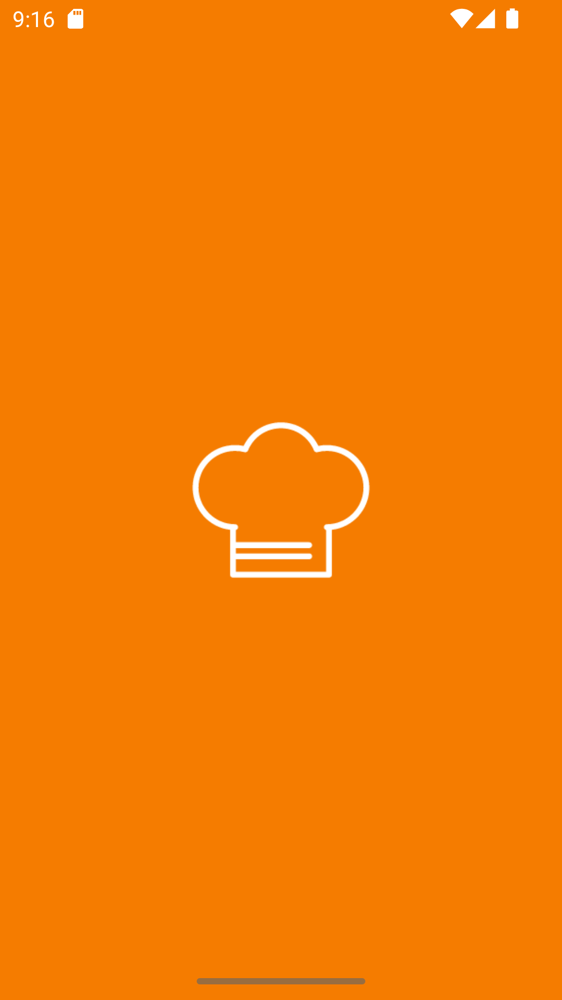
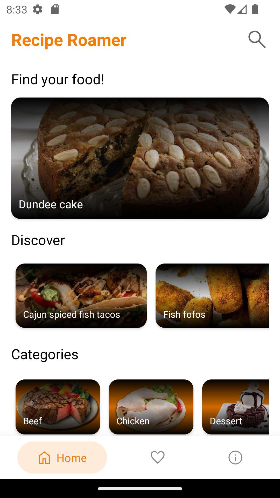
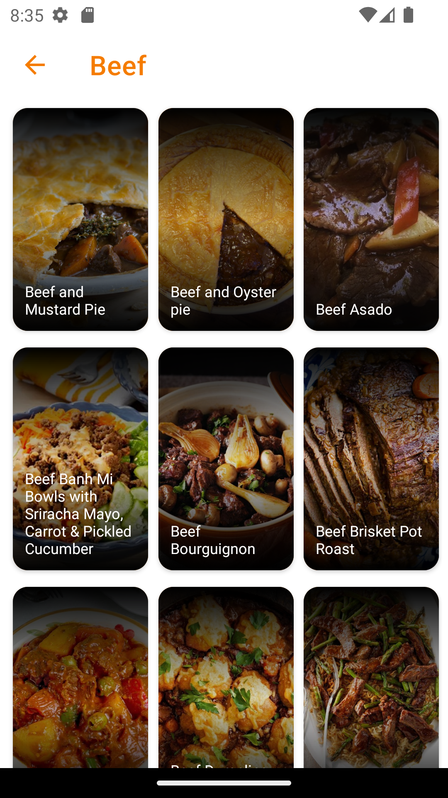
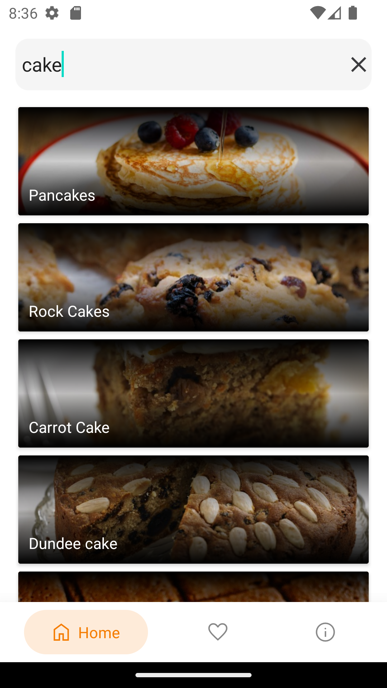
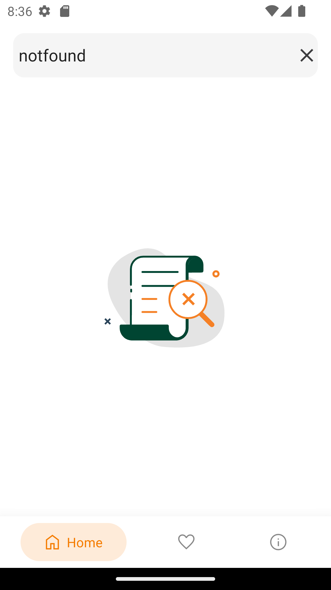
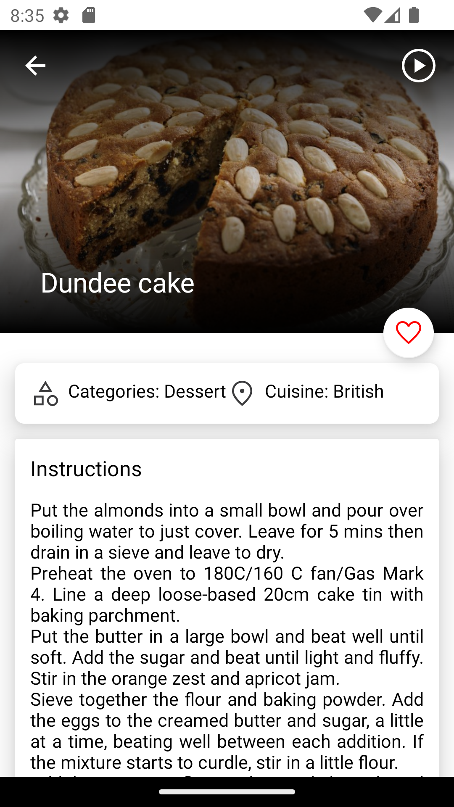
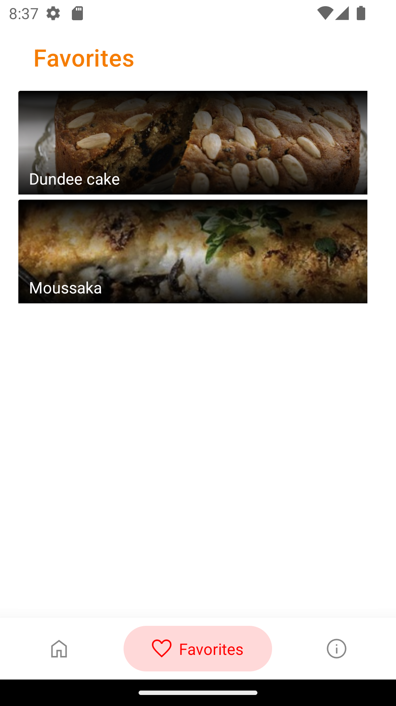
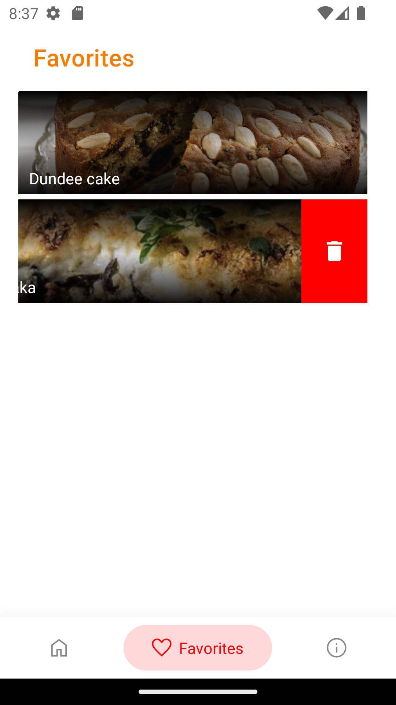
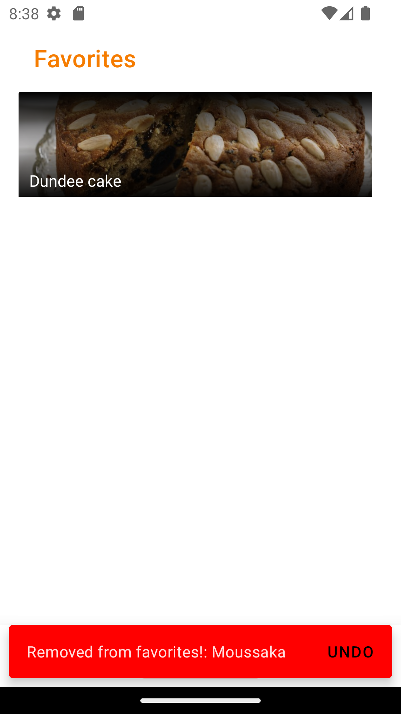
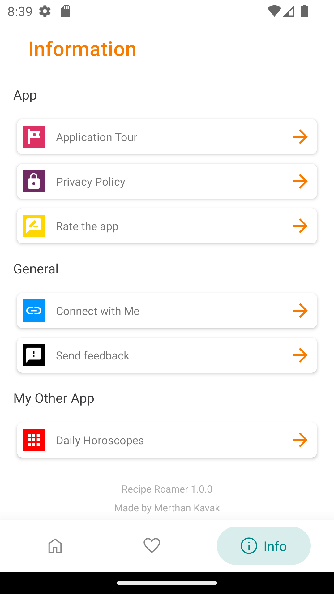

# Recipe Roamer

Recipe Roamer app is a mobile application developed using Android Kotlin, It uses
the [TheMealDB API](https://www.themealdb.com/api.php) for recipes. Within the app, you can explore
different recipes, watch how to cook them, and even save your favorites.

## Tech and Libraries

- [Kotlin coroutines](https://developer.android.com/kotlin/coroutines)
- [ViewModel](https://developer.android.com/topic/libraries/architecture/viewmodel?hl=en)
- [Dependency injection with Hilt](https://developer.android.com/training/dependency-injection/hilt-android)
- [REST client with Retrofit2](https://square.github.io/retrofit/)
- [Local database using Room](https://developer.android.com/training/data-storage/room)
- [In App Review](https://developer.android.com/guide/playcore/in-app-review/kotlin-java)
- [Glide](https://github.com/bumptech/glide)
- [Lottie](https://github.com/airbnb/lottie-android)
- [Swipe Reveal Layout](https://github.com/chthai64/SwipeRevealLayout)
- [Toasty](https://github.com/GrenderG/Toasty)
- [Bubble Tabbar](https://github.com/akshay2211/BubbleTabBar)
- [SSP - a scalable size unit for texts](https://github.com/intuit/ssp)
- [SDP - a scalable size unit](https://github.com/intuit/sdp)

## Screenshots

<table>
   <tr>
      <td>Splash</td>
      <td>Onboarding</td>
      <td>Home</td>
   </tr>
   <tr>
      <td width="33%"></td>
      <td width="33%"></td>
      <td width="33%"></td>
   </tr>
</table>
<table>
   <tr>
      <td>Category</td>
      <td>Search</td>
      <td>Not Found</td>
   </tr>
   <tr>
      <td width="33%"></td>
      <td width="33%"></td>
      <td width="33%"></td>
   </tr>
</table>
<table>
   <tr>
      <td>Food Details</td>
      <td>Food Details 2 </td>
      <td>Favorites</td>
   </tr>
   <tr>
      <td width="33%"></td>
      <td width="33%"></td>
      <td width="33%"></td>
   </tr>
</table>
<table>
   <tr>
      <td>Unfavorite</td>
      <td>Unfavorite 2 </td>
      <td>Information</td>
   </tr>
   <tr>
      <td width="33%"></td>
      <td width="33%"></td>
      <td width="33%"></td>
   </tr>
</table>
